# Lens — Build phases (master index)

**Status:** Active  
**Last updated:** 2026-04-10  
**Audience:** human drivers, coding agents, phase planning  
**Related:** [Product spec](./2026-04-09-lens-design.md) · [Build strategy](./2026-04-10-lens-build-strategy.md) · [Agent orientation](../2026-04-10-lens-agent-orientation.md)

---

## Purpose

This document is the **single canonical roadmap** for implementation order. Product behaviour and data models remain defined in the [product spec](./2026-04-09-lens-design.md). Per-phase work may add companion artefacts (design notes, implementation plans) as needed; their naming convention is below.

**Terminology:** **Build Phase 0** means repository and Xcode bootstrap only. The **add-on vertical slice** (remote zip install on macOS, reference add-on) is **Build Phase 2**, not a separate “Phase 0” for add-ons—see [§5.2 Addon phased approach](./2026-04-09-lens-design.md#52-phased-approach) in the product spec.

---

## Flow overview

```mermaid
flowchart LR
  P0[Phase0_Bootstrap]
  P1[Phase1_HelloWorld]
  P2[Phase2_Foundation]
  P3[Phase3_Timeline]
  P4[Phase4_Reader]
  P5[Phase5_Feeds]
  P6[Phase6_OfflineSearch]
  P7[Phase7_Settings]
  P8[Phase8_OPMLShare]
  P9[Phase9_A11yI18n]
  P0 --> P1 --> P2 --> P3 --> P4 --> P5 --> P6 --> P7 --> P8 --> P9
```

---

## Per-phase section template

Each numbered phase below uses this structure:

1. **Goal** — one short paragraph.
2. **Human vs agent** — who does what (see [build strategy](./2026-04-10-lens-build-strategy.md)).
3. **Deliverables** — concrete outputs.
4. **Entry criteria** — what must already be true.
5. **Exit criteria** — done means; includes updating [agent orientation](../2026-04-10-lens-agent-orientation.md) whenever code or project structure changes.
6. **Deeper docs** — optional follow-on artefacts for this phase only.

---

## Future per-phase artefacts (naming)

When a phase needs extra documents, use:

- `2026-04-10-lens-phase-N-design.md` — design / spec notes for that phase (optional).
- `2026-04-10-lens-phase-N-implementation-plan.md` — step-by-step implementation plan (optional).

Replace the date prefix if you start a new doc series. Do not create empty stubs; add files when work begins.

---

## Phase 0 — Project bootstrap

**Goal:** Establish a git repository, Xcode multi-target layout aligned with [agent orientation](../2026-04-10-lens-agent-orientation.md), and minimal documentation so subsequent phases have a stable home.

**Human vs agent**

- **Human:** Create/open the Xcode project, configure signing when needed, add capabilities (e.g. App Groups) per instructions from the phase plan; run builds.
- **Agent:** Repository layout, `.gitignore`, README, Swift/project file edits, and documentation that reference correct paths and capabilities.

**Deliverables**

- Git repository initialized; sensible `.gitignore` for Xcode / SwiftPM.
- `Lens.xcodeproj` (or workspace) with targets matching the intended module layout: **LensCore**, **LensUI**, **LensIOS**, **LensMac** (names may be adjusted but roles must match orientation).
- Folder structure under the repo root consistent with embedding source in those targets.
- **README** at repo root: what Lens is, how to open the project, that verification is human-driven in Xcode, links to [build strategy](./2026-04-10-lens-build-strategy.md) and [product spec](./2026-04-09-lens-design.md).
- App Group identifier and capability steps **documented** for upcoming SwiftData work ([build strategy §7.2](./2026-04-10-lens-build-strategy.md)); wiring may complete in Phase 0 or Phase 2 per implementation plan.

**Entry criteria:** None (greenfield).

**Exit criteria:** Project opens in Xcode; structure matches orientation; README and git baseline in place. Update **Current state** in agent orientation when this phase lands.

**Deeper docs:** Optional Phase 0 design / implementation plan if bootstrap is non-trivial.

---

## Phase 1 — Hello world and verification

**Goal:** Prove the full **human** verification loop: clean, build, and run on **iOS Simulator**, a **physical iOS device**, and **macOS**, with documented steps.

**Human vs agent**

- **Human:** Clean Build Folder (⇧⌘K), Build (⌘B), Run (⌘R); manage destinations and signing; report errors verbatim.
- **Agent:** Minimal UI (e.g. per-platform label or shared placeholder) and any project settings needed for all three destinations.

**Deliverables**

- Apps launch on all three destination types with a trivial, visible UI.
- Short documentation (README section or build-strategy pointer) listing the exact verification steps and what “success” looks like.

**Entry criteria:** Phase 0 complete.

**Exit criteria:** You can repeat clean/build/run confidently for iOS Simulator, device, and Mac. Update agent orientation if schemes or target names are finalized.

**Deeper docs:** Optional Phase 1 notes if onboarding steps are elaborate.

---

## Phase 2 — Foundation, add-on shell, minimal ingestion

**Goal:** Stand up **LensCore** (SwiftData with App Group `ModelContainer`, event bus, addon registry), **ThemeEngine** skeleton, **DeepLinkRouter**, minimal RSS/Atom fetch, seeded categories, documented event stubs—and **prove the macOS remote add-on pipeline** (zip download, verify, unpack, install, one reference add-on). This phase **embeds** the add-on vertical slice; it is not a separately numbered “Phase 0” for add-ons.

**Human vs agent**

- **Human:** Run macOS and iOS builds; on Mac, exercise add-on URL flow as specified in the implementation plan; device testing as needed.
- **Agent:** All Swift modules, parsers, persistence, networking, event types, macOS-only install path for remote add-ons per [product spec §5.3](./2026-04-09-lens-design.md#53-remote-hosting--package-format).

**Deliverables**

- Swift package / targets per orientation; **LensCore** has no SwiftUI imports.
- SwiftData models and App Group–backed container (see spec §2.3, §7).
- Event bus types and registration points; stubs documented toward the future event catalog (spec §9).
- Add-on registry; `.zip` + `manifest.json` flow on **macOS only** for remote install; one reference add-on.
- Minimal feed fetch for core formats; feed factory extensibility hooks.
- **ThemeEngine** and **DeepLinkRouter** scaffolding; `lens://` handling at scene level (spec §4.12).
- Predefined categories seeded on first launch (spec §3.2, §7.1).

**Entry criteria:** Phase 1 complete.

**Exit criteria:** Core architecture is integrated; macOS add-on end-to-end path demonstrated. Agent orientation updated (modules, key files, scheme names if known).

**Deeper docs:** Phase 2 design / implementation plan expected for this large phase.

---

## Phase 3 — Timeline UI

**Goal:** Main chronological timeline, read/unread, filters (spec §4.2), macOS keyboard navigation, iOS gestures, new-items banner, feed health indicators.

**Human vs agent**

- **Human:** UI verification on iPhone, iPad-sized window if applicable, and Mac.
- **Agent:** **LensUI** and app shells; list performance and event emissions per spec.

**Deliverables**

- Single chronological stream with ordering rules (spec §7.2).
- Unread-only and other quick filters; per-feed views as specified.
- macOS single-letter shortcuts where required (spec §3.1); iOS swipe and long-press behaviour (spec §3.1).
- New items banner on main timeline only (spec §3.1).
- Feed health UI (badges, errors, retry) aligned with spec §3.2, §4.14.

**Entry criteria:** Phase 2 complete.

**Exit criteria:** Timeline usable as the primary surface; agent orientation updated if layout or major files change.

**Deeper docs:** Optional.

---

## Phase 4 — Reader

**Goal:** **WKWebView** reader with sanitization, full **ThemeEngine** composition (structural, token, theme layers), reading preferences, starred vs saved actions, link behaviour (spec §2.4, §3.3–§3.4, §3.8).

**Human vs agent**

- **Human:** Exercise reader on both platforms; test external links and accessibility basics.
- **Agent:** HTML pipeline, `WKNavigationDelegate`, preference wiring, events for reader lifecycle.

**Deliverables**

- Sanitized HTML rendering; sandboxed navigation; CSS injection contract (spec §2.4, §9 token contract toward).
- **UserReadingPreferences** surfaced where required for v1; afforded fields respected per orientation.
- Starred vs offline save distinct (spec §3.4).
- External link setting: system browser vs in-app (spec §3.3).

**Entry criteria:** Phase 3 complete.

**Exit criteria:** Reading experience matches spec for v1 scope; agent orientation updated if needed.

**Deeper docs:** Optional.

---

## Phase 5 — Feeds management

**Goal:** Add/edit/delete feeds; categories (predefined + custom); favicon/monogram; discovery; sidebar sort order; per-feed health display (spec §3.2).

**Human vs agent**

- **Human:** Add feeds via URL, verify discovery and errors on device and Mac.
- **Agent:** Feed CRUD, category model, discovery pipeline, UI preferences for sort order.

**Deliverables**

- Feed editor flows; category rename/add/delete; fuzzy-match suggestion intent (spec §3.2).
- Feed ordering from **UserInterfacePreferences** (spec §7.1).
- Health and retry UX on feed rows.

**Entry criteria:** Phase 4 complete.

**Exit criteria:** Users can manage subscriptions end-to-end; agent orientation updated if needed.

**Deeper docs:** Optional.

---

## Phase 6 — Offline save and saved search

**Goal:** Save article HTML and assets offline; **search within saved items only**; apply retention policy excluding starred/saved/unread as specified (spec §4.1, §4.13).

**Human vs agent**

- **Human:** Airplane-mode style testing; large saves; search UX.
- **Agent:** Offline pipeline, **OfflineAsset** model, indexing approach, background eviction jobs.

**Deliverables**

- Save/remove offline; storage errors surfaced without modal spam.
- Search UI pinned to Saved Items (spec §4.1).
- Retention policy execution and settings wiring (spec §4.13).

**Entry criteria:** Phase 5 complete.

**Exit criteria:** Offline and search match v1 scope; agent orientation updated if needed.

**Deeper docs:** Optional.

---

## Phase 7 — Settings and onboarding

**Goal:** First-run onboarding; settings scaffold for refresh, badges, reading and interface preferences, retention, keyboard reference, about (spec §3.6, §4.5).

**Human vs agent**

- **Human:** Walk through onboarding and settings on both platforms.
- **Agent:** SwiftData preference singletons, navigation to settings sections, event hooks.

**Deliverables**

- Onboarding: add feeds, categories, minimal copy (polish can iterate).
- Global background refresh + badge toggle; list density slider; appearance override; retention UI.
- Deep links to settings where applicable (spec §4.12).

**Entry criteria:** Phase 6 complete.

**Exit criteria:** Settings and onboarding cover v1 requirements; agent orientation updated if needed.

**Deeper docs:** Optional.

---

## Phase 8 — OPML and sharing

**Goal:** OPML import/export; system share sheet; open in browser (spec §4.3, §4.12).

**Human vs agent**

- **Human:** Test import from files and URLs; share from reader and lists.
- **Agent:** OPML parsers/serializers, file pickers, share hooks, `lens://import` behaviour.

**Deliverables**

- Import/export per spec; share and copy link flows.
- Integration with deep links for import where specified.

**Entry criteria:** Phase 7 complete.

**Exit criteria:** Sharing and OPML work for v1; agent orientation updated if needed.

**Deeper docs:** Optional.

---

## Phase 9 — Accessibility and internationalization readiness

**Goal:** Meet accessibility expectations (spec §4.9); externalize strings and locale-aware formatting (spec §4.11); treat as a release gate.

**Human vs agent**

- **Human:** VoiceOver, Dynamic Type, keyboard navigation on Mac; RTL spot-checks if available.
- **Agent:** Fixes from audit; `String(localized:)` / catalogs as project standard.

**Deliverables**

- Documented audit pass with fixes for blocking issues.
- String externalization habit enforced for UI touched in prior phases.

**Entry criteria:** Phase 8 complete.

**Exit criteria:** Accessibility and i18n readiness criteria for v1 satisfied; agent orientation updated.

**Deeper docs:** Optional checklist artefact.

---

## Future / post–v1 (not numbered phases here)

Tracked in the [product spec](./2026-04-09-lens-design.md); examples include:

- Card list density with thumbnails (§4.15); read time display; **widgets** (§4.6); bionic reading; image lightbox; **duplicate detection** (§4.7); full-article fetch add-on (§4.8); **add-on store UX** (spec §5.2 Phase C); **share extension** (§4.16); **iOS remote add-ons**; **iCloud sync** (§6).

When one of these becomes active work, add a dedicated phase entry in **this** document or a dated supplement—avoid duplicating the full roadmap in the product spec’s §10.

---

## End-of-phase housekeeping

Every implementation phase that changes code or project structure must end with updating [agent orientation](../2026-04-10-lens-agent-orientation.md): **Current state**, **Module layout** if folders changed, and **scheme names** in the agent/human table when known. See [CLAUDE.md](../../../CLAUDE.md).
